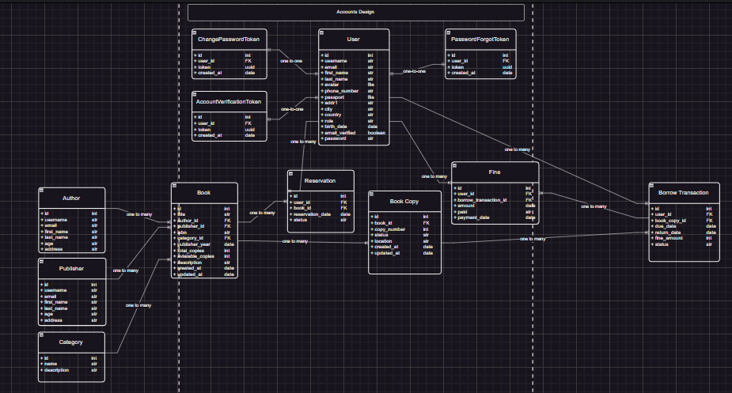

<h1 align="center">📚 Library Management System</h1>
<p align="center">
  A powerful and scalable library system built with Django, Docker, and MySQL.  
</p>

<div align="center">

[](./LICENSE)
[](https://www.python.org/)
[](https://www.djangoproject.com/)
[]()
[]()

</div>

---

## 📸 ERD (Entity Relationship Diagram)

<div align="center">
  
</div>

> *Designed with draw.io — shows how models like `Book`, `borrow`, and `user` relate.*

---

## 🔥 Features

- ✅ Book CRUD operations  
- ✅ Member registration & profile tracking  
- ✅ Book issue/return with due date  
- ✅ Fine calculation for late returns  
- ✅ Admin dashboard via Django admin  
- ✅ Search, filter, and pagination  
- ✅ Built with Docker for easy deployment  

---

## ⚙️ Technologies Used

| Stack        | Tech                           |
|--------------|--------------------------------|
| Backend      | Python 3.10+, Django 5.2       |
| Database     | MySQL                          |
| Frontend     | HTML5, CSS3, Bootstrap 5       |
| DevOps       | Docker, Docker Compose         |
| Visualization| draw.io (for ERD diagrams)     |

---

## 📁 Project Structure

```markdown
LibraryManagementSystem/
├── accounts/
│   ├── models.py
│   ├── views.py
│   └── templates/
│       └── ...
├── books/
│   ├── models.py
│   ├── views.py
│   └── templates/
│       └── ...
├── dashboard/
│   ├── models.py
│   ├── views.py
│   └── templates/
│       └── ...
├── core/
│   ├── models.py
│   ├── views.py
│   └── templates/
│       └── ...
├── static/
├── docs/
├── Dockerfile
├── docker-compose.yml
├── manage.py
└── README.md
```

## 🐳 Docker Setup

1. **Build & start containers**

```bash
docker-compose up --build
docker-compose exec web python manage.py migrate
docker-compose exec web python manage.py createsuperuser

## 🧪 Development (without Docker)
# Create virtual environment
python -m venv env
source env/bin/activate   # Windows: env\Scripts\activate

# Install requirements
pip install -r requirements.txt

# Run migrations
python manage.py migrate

# Start dev server
python manage.py runserver
```

## 👤 Author
Esmayullah — Software Engineer & Django Enthusiast
📧 Contact: [esmatullahhadel98@gmail.com]